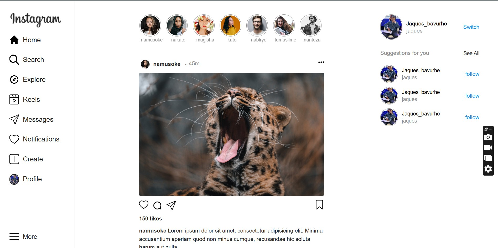
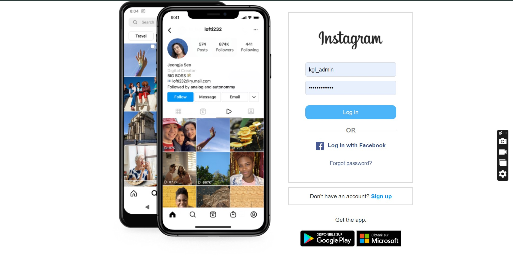

# Instagram Clone

This is an Instagram clone built using HTML, CSS, JavaScript, and Bootstrap. The main focus of this project was to replicate the front-end design and functionality of the original Instagram website while making it responsive to different screen sizes.

# Live Preview

To view the Instagram clone, simply open 
https://jaquesbavurhe.github.io/Instagram-clone/
```
# Screenshots





# Technologies Used

✳ HTML </br>
✳ CSS  </br>
✳ JavaScript  </br>
✳ Bootstrap  </br>
